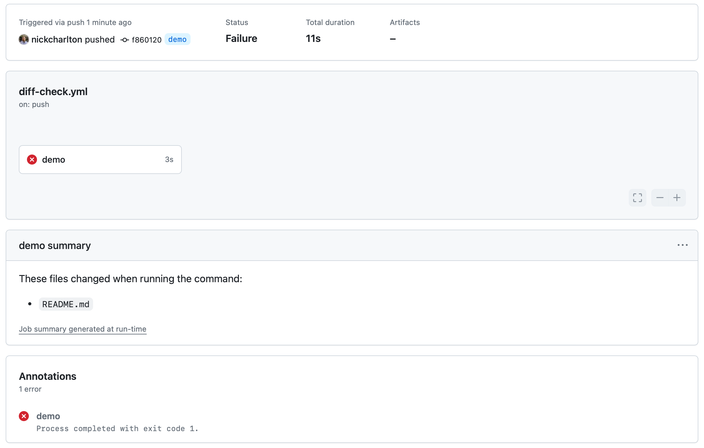

# diff-check

An Action which runs a command and fails if it changes anything.

It's ideal for catching situations where tools like Dependabot might not bump
other dependencies, like with tools like [Appraisal][]'s `gemfiles` or [native
iOS dependencies (`ios/Podfile.lock`)][cocoapods] when updating `npm`
dependencies on [React Native][].

The results are reported with a failed action run, and presented in the [job
summary][].

[Appraisal]: https://github.com/thoughtbot/appraisal
[cocoapods]: https://cocoapods.org
[React Native]: https://reactnative.dev
[job summary]: https://docs.github.com/en/actions/using-workflows/workflow-commands-for-github-actions#adding-a-job-summary

## Example



`.github/workflows/diff-check.yml`:

```yaml
---
name: diff-check
on: [push]

jobs:
  demo:
    runs-on: ubuntu-latest
    steps:
      - uses: actions/checkout@v4
      - uses: nickcharlton/diff-check@main
        with:
          command: echo "hello world" >> README.md
```
